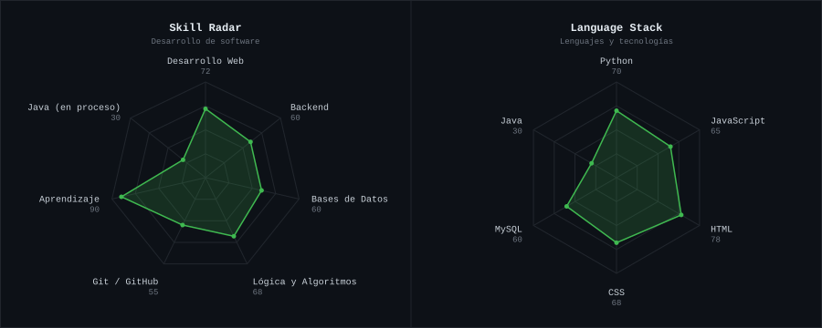

  

  

  
 
  

  

---

<h2 align="center">This is me :)</h2>

Hola, soy **Christofer Orduz**, desarrollador de software desde **Colombia**. Me gusta construir cosas que funcionen y aprender algo nuevo con cada proyecto.

- 💻 Desarrollo con **Python, JavaScript, HTML y CSS**
- 🗄️ Trabajo con bases de datos **MySQL**
- ☕ Aprendiendo **Java** (en proceso)
- 🌱 **Mi objetivo:** seguir creciendo, compartir lo que aprendo y lanzar proyectos reales
- 💬 Háblame de desarrollo web y código, con gusto te respondo

---

<h2 align="center">my perfect stack</h2>

   

---

<h2 align="center">signals</h2>

    

---

<h2 align="center">Numbers matter? ohh yes.</h2>

    

---

<code>@orduzdarney-dot</code>

